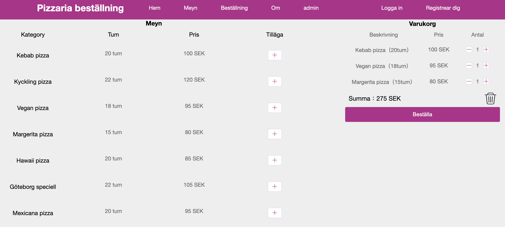
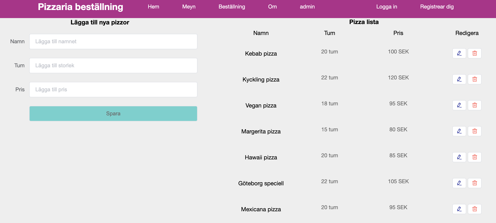

# Welcome to pizzaria! 

## An exercise of ordering pizza online.

## Technologies used 
 - Javasript
 - Html
 - CSS
 - Vue2.0
 - Vue-cli
 - Element UI
 - Webpack
 - Axios 
 


## Functionality
- Login and Registration
- Pizza browsing: browse pizzas, prices, quantity and add to the cart 
- Cart browsing: add or remove pizzas, see total price and generate orders
- Submit orders 
- Admin page: add more pizzas, edit existing pizzas' prices and save  

## Setup
Run the following commands in a terminal: 
  ```
  npm install
  ```
  ```
  npm run dev
  ```

## Screenshots
 

 

 


